# iDX - Biblioteca Online

iDX é uma plataforma de biblioteca online que permite aos administradores cadastrar categorias e livros pelo sistema web e aos usuários comuns lerem e acompanharem o progresso de leitura no app mobile.

## Tecnologias Utilizadas

### Backend
- **Laravel**: API para gerenciamento de dados.
  - Testes automatizados com **Pest**.

### Frontend Web
- **Next.js**: Interface para administração do sistema.
  - **React Hook Form** para gerenciar formulários.
  - **Tailwind CSS** para estilização.
  - **TypeScript** para tipagem.
  - **Zod** para validação.

### Mobile
- **React Native**: Aplicativo para leitura e progresso de leitura.
  - **React Hook Form** para gerenciar formulários.
  - **Tailwind CSS (Nativewind)** para estilização.
  - **TypeScript** para tipagem.
  - **Zod** para validação.

## Funcionalidades

- **Administradores**:
  - Cadastro e gerenciamento de categorias e livros pelo sistema web.
- **Usuários**:
  - Leitura de livros pelo aplicativo.
  - Progresso de leitura salvo na API.

## Demonstração

Confira um vídeo de demonstração no YouTube:  
[Assista aqui](https://youtu.be/SJ7fAy2PKVU)

## Imagens das Páginas
### Web
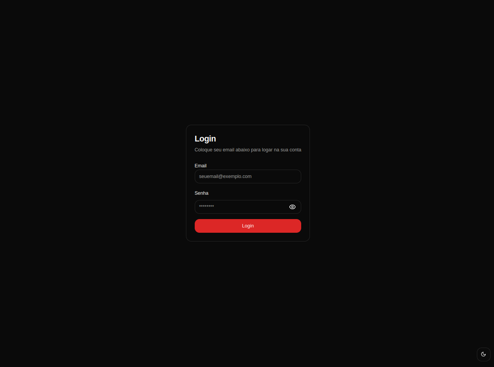
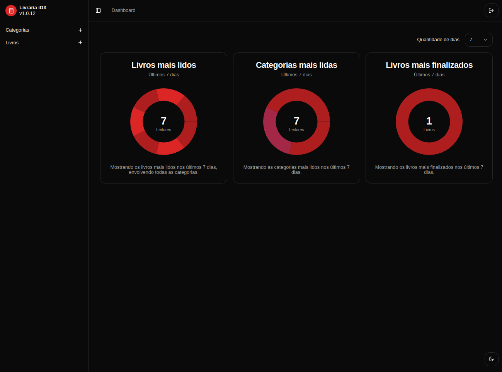
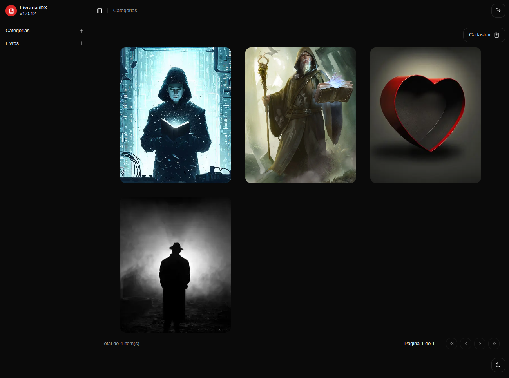
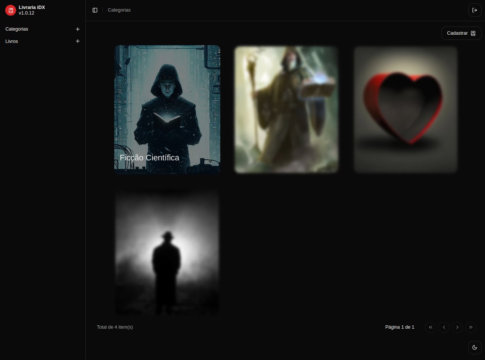
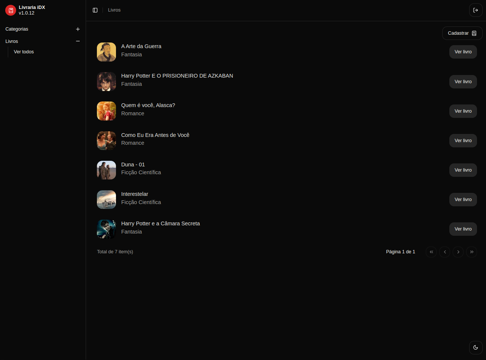

### Mobile
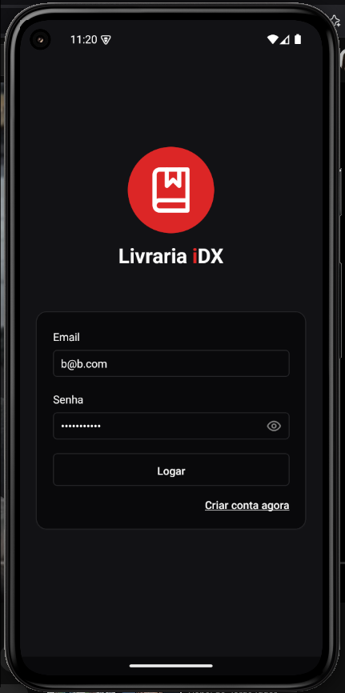
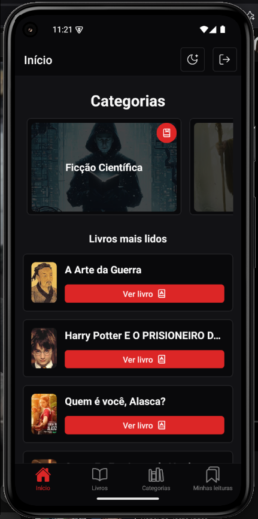
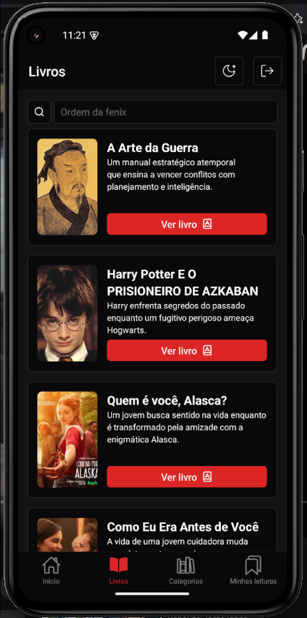
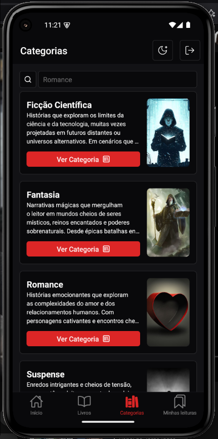
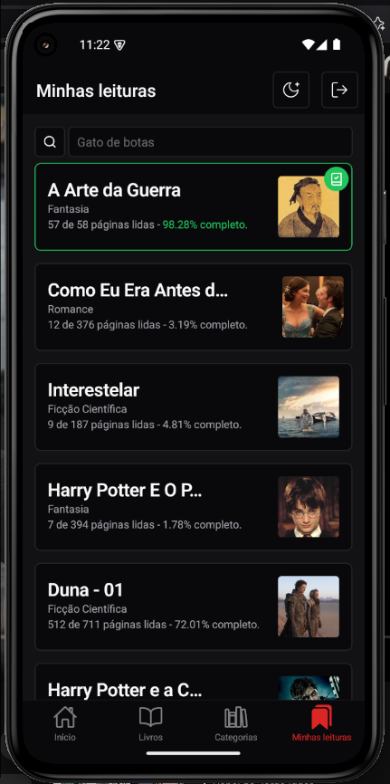
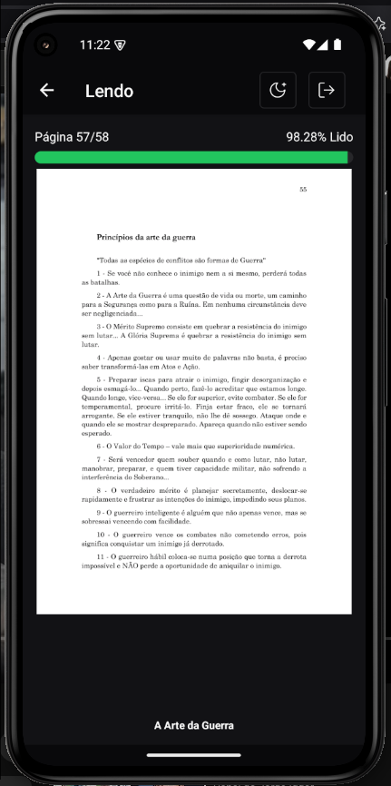
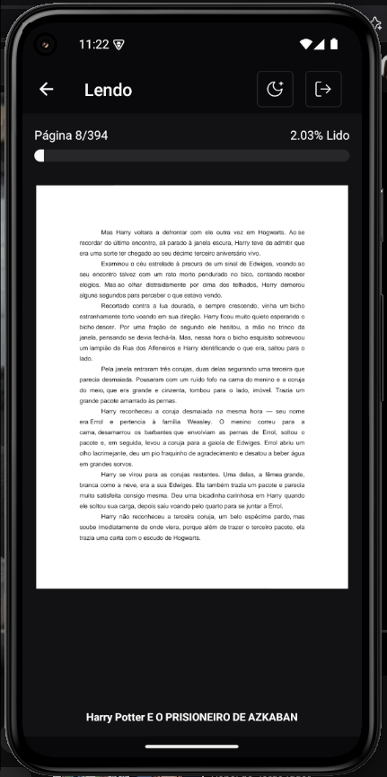

## Feito por Caio Souza 👨‍💻
